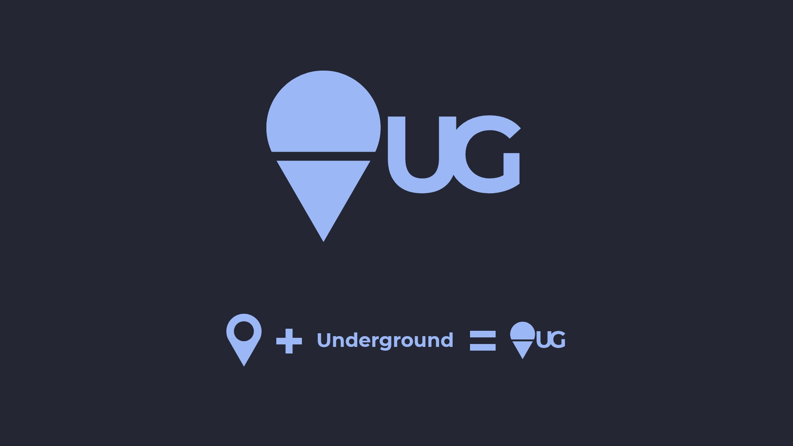

# **Underground**
-------------------
**Underground is a 100% anonymous event website made with Laravel**

### **Setup**
---------------
1. Clone or download the project

2. Create the database and configure `.env` file

3. Run this command for storage configuration in larvel
    ```bash
    php artisan storage:linke
    ``` 

4. Add [algolia](https://www.algolia.com/) app key and secret to the `.env` file


**What I learned from it 😊**
* Using Google maps
* Dates validation in laravel
* Using sweetalert

### **Tools, Framworks And Libraries**
--------------------------------------
1. Design
    * Adobe XD
    * Illustrator (for the logo)
2. Backend
    * Laravel
    * eloquent-sluggable
3. Frontend
    * Pug
    * Sass
    * Colcade
    * Sweetalert2
    * particles.js
    
## **Design** 
------------------------
_all text are lorem ipsum_

#### **Logo**


#### **Home**


#### **Explore**


#### **Create Event Page**


#### **Event**


See the design on 
[Behance](https://www.behance.net/gallery/93142129/Underground)

Video preview for the website [Vimeo](https://vimeo.com/395029196)

My
[Twitter](https://twitter.com/MrMohamed98) | 
[Linkedin](https://www.linkedin.com/in/mohamed-abdallah-b731b61a2/)